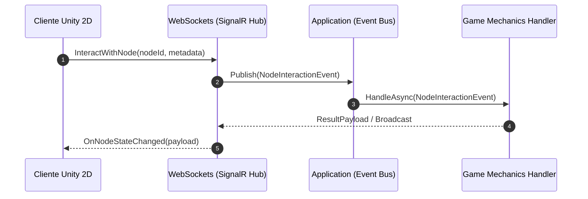

# Unity 2D Multiplayer .NET Backend Template 🚀


---

## 1. Descripción General

**Unity 2D Multiplayer .NET Backend Template** es una plantilla base (*starter template / boilerplate*) modular de alto rendimiento desarrollada en C# y .NET Core, diseñada para servir como infraestructura backend en **juegos multijugador 2D y entornos virtuales espaciales en Unity** (estilo *Gather Town*, RPGs 2D *top-down*, salas virtuales de interacción espacial o juegos sociales).

La plantilla proporciona un motor desacoplado y listo para producción que gestiona la **presencia y movimiento 2D en tiempo real**, **mensajería espacial por proximidad y global**, **sincronización de objetos/nodos interactivos en el mapa** y **gestión de salas/instancias de juego**, manteniendo una arquitectura limpia y extensible.

### Propósito Técnico y Arquitectónico
* **Plantilla Reutilizable:** Eliminar el trabajo repetitivo al iniciar nuevos proyectos multijugador 2D en Unity, proporcionando una base sólida con WebSockets, persistencia y Clean Architecture.
* **Escalabilidad y Baja Latencia:** Sincronizar el estado de múltiples jugadores en planos cartesianos 2D con latencias mínimas y capacidad de escalado horizontal mediante Redis Backplane.

---

## 2. Justificación Técnica del Stack (C# / .NET Core)

La elección de **C# y .NET Core** como stack primario del servidor backend permite una integración nativa y transparente con juegos creados en **Unity**:

* 🤝 **Unificación de Lenguaje con el Cliente Unity 2D:**
  Unity utiliza C# como su lenguaje principal de desarrollo. Implementar el servidor en C# y .NET permite **compartir DTOs, estructuras de datos, enumeraciones y lógica de dominio** entre cliente y servidor, reduciendo errores de serialización y acelerando el ritmo de desarrollo.

* ⚡ **SignalR para WebSockets de Alto Rendimiento:**
  ASP.NET Core SignalR abstrae la comunicación en tiempo real cliente-servidor mediante WebSockets (con fallback automático). Ofrece un manejo nativo de grupos por sala (*Rooms*), difusión de coordenadas $X,Y$ y escalabilidad distribuida mediante Redis Backplane.

* 🚀 **Rendimiento, Concurrencia y Bajo Consumo:**
  Gracias al servidor Kestrel, la optimización de memoria con `Span<T>` / `Memory<T>` y el modelo de concurrencia asíncrona (`async`/`await`), .NET permite procesar miles de mensajes por segundo con un consumo de recursos muy reducido.

* 🧩 **Clean Architecture e Inyección de Dependencias:**
  Facilita el desacoplamiento de componentes, promueve principios SOLID, permite realizar pruebas unitarias sobre casos de uso sin depender del servidor web o la base de datos, e integra patrones como CQRS y Repository.

* 🐳 **Preparado para Contenerización (Docker):**
  Despliegue ágil en contenedores Linux optimizados, facilitando la integración continua (CI/CD) y la orquestación en plataformas como Kubernetes, Docker Swarm o servicios en la nube (AWS, Azure, GCP).

---

## 3. Arquitectura del Sistema (Clean Architecture)

El proyecto adopta **Clean Architecture** (Arquitectura Limpia), organizando el código en 4 capas concéntricas donde la capa de **Dominio** actúa como el núcleo independiente sin referencias externas.

### Diagrama de Capas (Mermaid)


### Responsabilidad de las Capas

1. 🟢 **`Domain` (Capa de Dominio):**
   * Núcleo del sistema sin dependencias externas. Contiene entidades puras (`Player`, `Room`, `InteractiveNode`, `ChatLog`), reglas del mundo virtual y objetos de valor.

2. 🔵 **`Application` (Capa de Aplicación):**
   * Orquesta los casos de uso del juego (ej. `JoinRoomUseCase`, `MovePlayerCommand`, `SendSpatialChatMessage`). Define interfaces para repositorios, notificaciones en tiempo real y DTOs.

3. 🟤 **`Infrastructure` (Capa de Infraestructura):**
   * Implementa la persistencia de datos (Entity Framework Core con PostgreSQL o SQL Server), la distribución de estado con Redis y los servicios de autenticación/JWT.

4. 🟣 **`WebApi` (Capa de Presentación / API):**
   * Expone los puntos de entrada HTTP RESTful y los *SignalR Hubs* de tiempo real (`GameHub`, `ChatHub`), gestionando la seguridad, CORS y middlewares.

---

## 4. Requisitos Funcionales y No Funcionales (SRS Resumido)

### Requisitos Funcionales (RF)

* 🔐 **RF-01: Autenticación y Control de Acceso**
  * Validación e inicio de sesión de jugadores mediante JWT, asignando roles (`Player`, `Admin`, `Moderator`).
* 📍 **RF-02: Movimiento y Presencia 2D en Tiempo Real**
  * Recepción y retransmisión de posiciones $(X, Y)$, orientación del avatar y animación entre jugadores conectados a la misma sala o mapa.
* 💬 **RF-03: Sistema de Chat Espacial (Proximidad) y Global**
  * **Chat Espacial:** Distribución de mensajes basada en distancia euclidiana respecto al emisor ($R$ configurable).
  * **Chat Global:** Canal de mensajería para toda la sala o mapa activo.
* 🧩 **RF-04: Nodos y Objetos Interactivos del Mapa**
  * Sincronización de estado e interacción con objetos 2D del escenario (puertas, cofres, reproductores de medios, enlaces externos, triggers de eventos).
* 🗺️ **RF-05: Gestión de Salas e Instancias de Juego**
  * Creación, configuración y control de aforo para salas de juego, mapas o zonas virtuales.

### Requisitos No Funcionales (RNF)

* ⚡ **RNF-01: Latencia y Rendimiento**
  * Latencia de sincronización de movimiento $< 50\text{ ms}$ en condiciones normales de red.
* 🧱 **RNF-02: Extensibilidad (Plugin-Ready)**
  * Diseño basado en eventos que permite añadir nuevas mecánicas de juego sin modificar el código core del dominio.
* 🐳 **RNF-03: Contenerización y Escalado Horizontal**
  * Despliegue en Docker y soporte de escalado multi-instancia mediante Redis Backplane para SignalR.
* 🛡️ **RNF-04: Seguridad en Comunicaciones**
  * Cifrado en tránsito (TLS/WSS) y validación de tokens en cada handshake de WebSocket.

---

## 5. Modelo de Datos y Extensiones

El modelo relacional combina tipos estricto para entidades clave con metadatos en formato JSON para permitir la máxima flexibilidad por juego.

### Entidades Principales

| Entidad | Descripción | Campos Clave | Uso de `MetadataJson` |
| :--- | :--- | :--- | :--- |
| **`Player`** | Jugadores o usuarios en el juego. | `Id`, `Username`, `Role`, `PositionX`, `PositionY`, `Direction`, `CurrentRoomId` | Almacena skins, accesorios, estadísticas de juego o atributos personalizados sin modificar la tabla. |
| **`Room`** | Salas, mapas 2D o instancias del mundo. | `Id`, `Name`, `Capacity`, `MapAssetUrl`, `IsActive` | Almacena configuraciones del mapa (límites $X,Y$, zonas de colisión, spawns y capas). |
| **`InteractiveNode`** | Objetos interactivos posicionados en el mapa. | `Id`, `RoomId`, `PositionX`, `PositionY`, `Type` | Define la carga útil del objeto (ej. URLs, diálogos, recompensas, configuraciones custom). |
| **`ChatLog`** | Historial de mensajes en el sistema. | `Id`, `RoomId`, `SenderId`, `Content`, `MessageType`, `Timestamp` | Guarda metadatos adicionales (ej. coordenadas de envío para auditoría de proximidad). |

### La Ventaja de `MetadataJson` para Juegos en Unity

Cada juego en Unity requiere propiedades distintas para sus personajes u objetos del escenario. El campo **`MetadataJson`** en la base de datos permite:
1. **Evitar Migraciones continuas:** Agregar atributos dinámicos a un personaje u objeto sin ejecutar migraciones SQL.
2. **Sincronización Transparente con C# en Unity:** El backend y el cliente Unity deserializan directamente el objeto JSON a clases de C# específicas del juego.

---

## 6. Instalación y Ejecución Local

### Prerrequisitos
* [.NET 9.0 SDK](https://dotnet.microsoft.com/download/dotnet/9.0)
* [Docker Desktop](https://www.docker.com/products/docker-desktop/) (Opcional para servicios)
* [Git](https://git-scm.com/)

---

### Opción A: Ejecución Local con .NET CLI

1. **Clonar el repositorio:**
   ```bash
   git clone https://github.com/tu-usuario/nombre-repositorio.git
   cd nombre-repositorio
   ```

2. **Restaurar dependencias:**
   ```bash
   dotnet restore
   ```

3. **Compilar la solución:**
   ```bash
   dotnet build --configuration Debug
   ```

4. **Ejecutar el servidor WebAPI / WebSockets:**
   ```bash
   dotnet run --project src/SenaVirtual.WebApi
   ```

---

### Opción B: Ejecución con Docker Compose 🐳

Levanta el servidor WebAPI junto con PostgreSQL y Redis de forma inmediata:

```bash
docker-compose up -d --build
```

Para detener los servicios:
```bash
docker-compose down
```

---

## 7. Extensibilidad y Mecánicas de Juego (Plugin Architecture)

La plantilla implementa un patrón **Plugin-Ready** mediante un Bus de Eventos orientados a interacción, permitiendo implementar mecánicas específicas para tu juego en Unity:



### Implementar una Nueva Mecánica

1. **Definir el Evento:**
   ```csharp
   public record CustomItemInteractEvent(Guid PlayerId, Guid NodeId, string Action) : INodeInteractionEvent;
   ```

2. **Crear el Handler:**
   ```csharp
   public class CustomItemInteractHandler : INodeInteractionHandler<CustomItemInteractEvent>
   {
       public async Task HandleAsync(CustomItemInteractEvent notification, CancellationToken cancellationToken)
       {
           // Lógica de juego personalizada
       }
   }
   ```

---

<p align="center">
  <b>Unity 2D Multiplayer .NET Backend Template</b><br/>
  <i>Base sólida de arquitectura limpia para el desarrollo de juegos multijugador 2D en Unity.</i>
</p>
