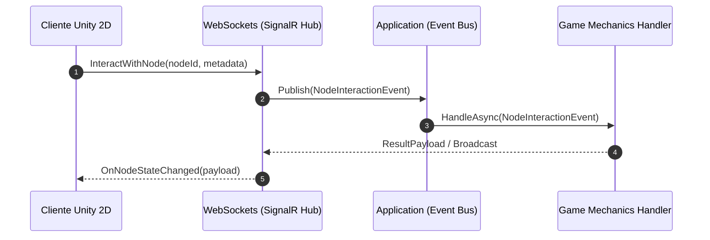

# Unity 2D Multiplayer .NET Backend Template 🚀

<p align="center">
  
  
  
  
  
  
</p>

---

## 📌 Tabla de Contenidos

1. [Descripción General](#1-descripción-general)
2. [Justificación Técnica del Stack](#2-justificación-técnica-del-stack-c--net-core)
3. [Estructura del Proyecto](#3-estructura-del-proyecto)
4. [Arquitectura del Sistema (Clean Architecture)](#4-arquitectura-del-sistema-clean-architecture)
5. [Requisitos Funcionales y No Funcionales (SRS)](#5-requisitos-funcionales-y-no-funcionales-srs)
6. [Modelo de Datos y Extensibilidad](#6-modelo-de-datos-y-extensibilidad)
7. [Endpoints API y Señales de Estado](#7-endpoints-api-y-señales-de-estado)
8. [Instalación y Ejecución Local](#8-instalación-y-ejecución-local)
9. [Extracción e Integración del Cliente SignalR en Unity](#9-extracción-e-integración-del-cliente-signalr-en-unity-net-standard-21)
10. [Mecánicas de Juego y Extensibilidad (Plugin-Ready)](#10-mecánicas-de-juego-y-extensibilidad-plugin-ready)

---

## 1. Descripción General

**Unity 2D Multiplayer .NET Backend Template** es un *boilerplate / starter template* empresarial de alto rendimiento desarrollado en C# y .NET Core. Sirve como infraestructura backend completa para **juegos multijugador 2D y entornos virtuales espaciales en Unity** (estilo *Gather Town*, RPGs 2D *top-down*, mundos virtuales de proximidad o juegos sociales).

El motor gestiona de forma desacoplada la **sincronización de presencia y movimiento 2D en tiempo real**, **mensajería espacial por proximidad y global**, **interacción con objetos/nodos del mapa** y la **gestión de instancias de juego**, manteniendo los principios de Clean Architecture.

> [!TIP]
> **Ventaja Clave:** Proporciona scripts de automatización multiplataforma para extraer las librerías cliente oficiales de SignalR en perfil **.NET Standard 2.1**, listas para importar directamente en Unity sin depender de paquetes de terceros.

---

## 2. Justificación Técnica del Stack (C# / .NET Core)

* 🤝 **Unificación de Lenguaje con Unity:** Al usar C# tanto en el servidor como en el cliente Unity, se comparten DTOs, enumeraciones y modelos de dominio, eliminando discrepancias de serialización.
* ⚡ **SignalR para WebSockets de Alta Concurrencia:** Abstrae la comunicación bidireccional en tiempo real, ofreciendo grupos por sala (*Rooms*), difusión espacial de coordenadas y soporte de escalado horizontal vía Redis Backplane.
* 🚀 **Procesamiento de Bajo Consumo y Alta Velocidad:** Potenciado por Kestrel, asignación de memoria optimizada con `Span<T>` y procesamiento no bloqueante con `async/await`.
* 🧩 **Clean Architecture:** Aislamiento total del núcleo del juego (*Domain*) respecto a bases de datos o frameworks web, facilitando pruebas unitarias e integración de patrones CQRS.
* 🐳 **Contenerización Nativa:** Despliegue en contenedores Docker livianos listos para orquestación en Kubernetes o plataformas en la nube.

---

## 3. Estructura del Proyecto

```text
SenaVirtualBackend/
├── Unity2DBackend.slnx               # Archivo de solución .NET
├── README.md                         # Documentación principal del repositorio
├── .gitignore                        # Reglas de exclusión para Git
├── src/                              # Código fuente en Clean Architecture
│   ├── Unity2D.Domain/               # Entidades puras y reglas de negocio
│   ├── Unity2D.Application/          # Casos de uso, DTOs e interfaces de servicios
│   ├── Unity2D.Infrastructure/       # EF Core, persistencia y Redis
│   └── Unity2D.WebApi/               # Controllers, SignalR Hubs y Middlewares
└── scripts/                          # Herramientas y Cliente Unity
    ├── build-signalr-unity.bat       # Script extractor de DLLs para Windows
    ├── build-signalr-unity.sh        # Script extractor de DLLs para Linux/macOS
    ├── README.md                     # Guía técnica de uso para desarrolladores Unity
    └── UnityClient/                  # Componentes C# listos para Unity (NetworkManager.cs)
```

---

## 4. Arquitectura del Sistema (Clean Architecture)


### Responsabilidades por Capa

| Capa | Proyecto | Responsabilidad |
| :--- | :--- | :--- |
| 🟢 **Dominio** | `Unity2D.Domain` | Entidades centrales (`Player`, `Room`, `InteractiveNode`), objetos de valor y reglas de negocio puras. |
| 🔵 **Aplicación** | `Unity2D.Application` | Lógica de los casos de uso (`MovePlayerCommand`, `SendChatMessage`), DTOs e interfaces de servicios. |
| 🟤 **Infraestructura** | `Unity2D.Infrastructure` | EF Core (PostgreSQL/SQL Server), servicios de autenticación JWT y Redis Backplane. |
| 🟣 **Presentación** | `Unity2D.WebApi` | Servidor WebAPI, *SignalR Hubs* (`GameHub`), endpoints de estado y políticas CORS. |

---

## 5. Requisitos Funcionales y No Funcionales (SRS)

### Requisitos Funcionales (RF)
* 🔐 **RF-01 Autenticación:** Inicio de sesión y validación de usuarios mediante JWT (Roles: `Player`, `Admin`, `Moderator`).
* 📍 **RF-02 Presencia 2D:** Sincronización en tiempo real de coordenadas $(X, Y)$, dirección del avatar y estado.
* 💬 **RF-03 Chat Espacial y Global:** Chat por distancia de proximidad euclidiana ($R$) y canales globales por sala.
* 🧩 **RF-04 Objetos Interactivos:** Sincronización de estado e interacción con elementos 2D del escenario.
* 🗺️ **RF-05 Gestión de Salas:** Creación, configuración y control de aforo en salas e instancias de juego.

### Requisitos No Funcionales (RNF)
* ⚡ **RNF-01 Latencia:** Sincronización de movimiento $< 50\text{ ms}$ en red local/estándar.
* 🧱 **RNF-02 Extensibilidad:** Arquitectura *Plugin-Ready* basada en eventos.
* 🐳 **RNF-03 Escalabilidad:** Sincronización multi-instancia mediante Redis Backplane para SignalR.

---

## 6. Modelo de Datos y Extensibilidad

| Entidad | Descripción | Campos Clave | Uso de `MetadataJson` |
| :--- | :--- | :--- | :--- |
| **`Player`** | Representa los jugadores en el juego. | `Id`, `Username`, `Role`, `PositionX`, `PositionY`, `Direction` | Skins, accesorios y estadísticas de juego dinámicas. |
| **`Room`** | Salas o mapas 2D del mundo virtual. | `Id`, `Name`, `Capacity`, `MapAssetUrl`, `IsActive` | Límites $X,Y$, zonas de colisión, spawns y capas del mapa. |
| **`InteractiveNode`** | Objetos interactivos en el mapa. | `Id`, `RoomId`, `PositionX`, `PositionY`, `Type` | Carga útil del objeto (ej. diálogos, recompensas, triggers). |
| **`ChatLog`** | Registro histórico de mensajes. | `Id`, `RoomId`, `SenderId`, `Content`, `MessageType`, `Timestamp` | Coordenadas $X,Y$ de envío para auditoría de proximidad. |

---

## 7. Endpoints API y Señales de Estado

El servidor expone endpoints de diagnóstico y tiempo real:

| Método | Endpoint | Descripción | Respuesta Ejemplo |
| :--- | :--- | :--- | :--- |
| `GET` | `/` | Señal principal de estado del servidor | `{"status": "Online", "service": "Unity 2D Backend", "version": "1.0.0"}` |
| `GET` | `/health` | Chequeo de salud del servicio | `{"status": "Healthy", "timestamp": "..."}` |
| `POST` | `/hubs/game/negotiate` | Punto de negociación de WebSockets SignalR | `{"connectionId": "...", "availableTransports": [...]}` |
| `GET` | `/openapi/v1.json` | Documentación OpenAPI / Swagger | Esquema OpenAPI 3.0 |

---

## 8. Instalación y Ejecución Local

### Opción A: Mediante la CLI de .NET

```bash
# 1. Clonar el repositorio
git clone https://github.com/FranTdev/Unity2DBackend.git
cd Unity2DBackend

# 2. Restaurar dependencias
dotnet restore

# 3. Compilar la solución
dotnet build Unity2DBackend.slnx

# 4. Iniciar el servidor backend (WebAPI + SignalR Hub)
dotnet run --project src/Unity2D.WebApi
```

### Opción B: Despliegue con Docker Compose 🐳

```bash
docker-compose up -d --build
```

---

## 9. Extracción e Integración del Cliente SignalR en Unity (.NET Standard 2.1)

> [!NOTE]
> Para conectar Unity (.NET Standard 2.1) con el servidor backend sin depender de librerías de terceros, proporcionamos scripts de extracción automatizados en la carpeta `scripts/`.

### 🚀 Flujo Rápido en 3 Pasos

```text
[ 1. Ejecutar Script ]  ──►  [ 2. Arrastrar a Unity ]  ──►  [ 3. Usar NetworkManager ]
 (scripts/build-signalr)      (Assets/Plugins/ & Scripts/)   (NetworkManager.Instance)
```

1. **Ejecutar Script de Extracción:**
   - **Windows:** Ejecuta [`scripts/build-signalr-unity.bat`](file:///c:/Users/FranT/Desktop/Back-End/.NET/SenaVirtualBackend/scripts/build-signalr-unity.bat)
   - **Linux/macOS:** Ejecuta [`scripts/build-signalr-unity.sh`](file:///c:/Users/FranT/Desktop/Back-End/.NET/SenaVirtualBackend/scripts/build-signalr-unity.sh)
2. **Copiar a Unity:**
   - Mueve la carpeta generada `scripts/SignalR_Unity_Libs/` a `Assets/Plugins/` en tu proyecto de Unity.
   - Mueve la carpeta `scripts/UnityClient/` a `Assets/Scripts/` en tu proyecto de Unity.
3. **Consumo desde C# en Unity:**
   Usa el componente [`NetworkManager.cs`](file:///c:/Users/FranT/Desktop/Back-End/.NET/SenaVirtualBackend/scripts/UnityClient/NetworkManager.cs):
   ```csharp
   using Unity2D.Client;

   // Enviar movimiento 2D al servidor
   await NetworkManager.Instance.SendMovementAsync("player-1", transform.position.x, transform.position.y);
   ```

*Consulta la [Guía Técnica de Scripts (`scripts/README.md`)](file:///c:/Users/FranT/Desktop/Back-End/.NET/SenaVirtualBackend/scripts/README.md) para más detalles.*

---

## 10. Mecánicas de Juego y Extensibilidad (Plugin-Ready)



---

<p align="center">
  <b>Unity 2D Multiplayer .NET Backend Template</b><br/>
  <i>Desarrollado con arquitectura limpia, alto rendimiento y extensibilidad modular.</i>
</p>
