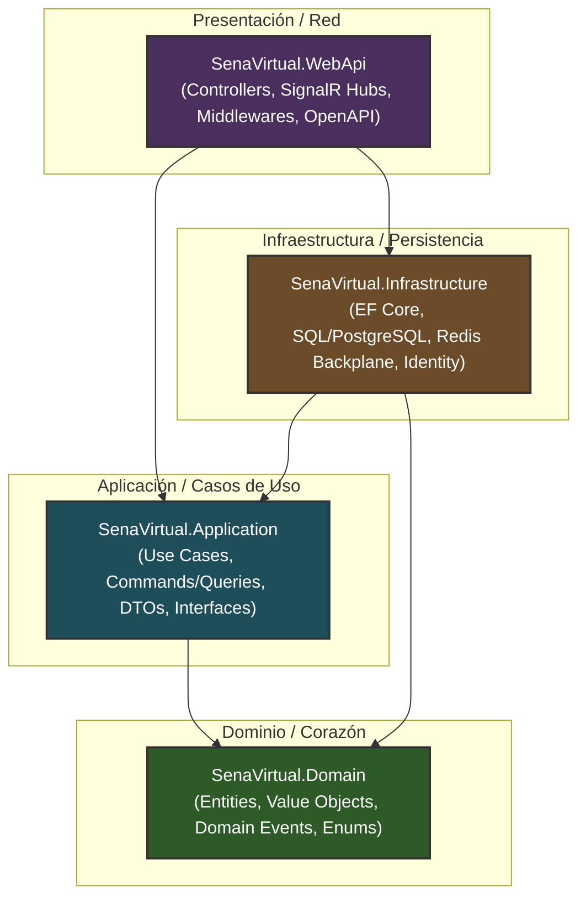
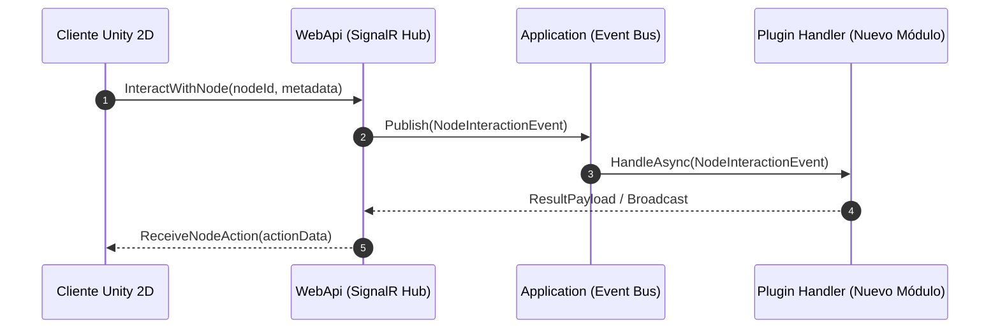

# SENA Virtual 2D Backend 🚀


---

## 1. Descripción General

**SENA Virtual 2D Backend** es la plataforma de servicios distribuidos y comunicación en tiempo real desarrollada para potenciar los ambientes de aprendizaje interactivos bidimensionales del **SENA Virtual**. 

Inspirado en ecosistemas de interacción espacial (como *Gather Town* o *Gartic Town*), este sistema permite a **aprendices e instructores** conectarse a aulas, laboratorios y auditorios virtuales 2D. A través de este servidor backend, los usuarios desplazan sus avatares en un plano cartesiano interactivo, participan en debates mediante **chat global o espacial (por proximidad)**, y activan **nodos interactivos** en tiempo real (acceso a guías de aprendizaje en PDF, enlaces a conferencias, tableros colaborativos y evaluaciones).

### Propósito Técnico y Educativo
* **Educativo:** Facilitar la inmersión, el trabajo colaborativo y la presencialidad remota interactiva en los programas de formación del SENA, rompiendo la barrera de las videollamadas tradicionales.
* **Técnico:** Proporcionar un motor backend escalable, resiliente y de baja latencia capaz de sincronizar estados de presencia espacial, mensajería concurrente e interacciones dinámicas mediante arquitectura limpia y contratos orientados a eventos.

---

## 2. Justificación Técnica del Stack (C# / .NET Core)

La elección de **C# y .NET Core** como lenguaje y framework principal responde a decisiones de arquitectura estratégica orientadas al ciclo de vida del software, rendimiento y mantenibilidad:

* 🤝 **Unificación de Lenguaje con el Cliente Unity 2D:**
  El motor cliente de la aplicación 2D interactiva se desarrolla en **Unity**, cuyo lenguaje primario es C#. Emplear C# en el backend permite compartir DTOs, estructuras de datos, enumeraciones y modelos de dominio entre cliente y servidor, reduciendo fricciones de serialización y facilitando la rotación de aprendices/desarrolladores entre ambas capas.

* ⚡ **SignalR para WebSockets de Alto Rendimiento:**
  ASP.NET Core SignalR abstrae la complejidad de la conexión bidireccional cliente-servidor a través de WebSockets (con fallback automático a Server-Sent Events o Long Polling). Facilita el manejo de grupos por sala (*Rooms*), la difusión masiva de coordenadas $X,Y$ y el escalado horizontal mediante Redis Backplane.

* 🚀 **Rendimiento, Concurrencia y Bajo Consumo:**
  .NET ofrece un rendimiento superior en pruebas comparativas de procesamiento HTTP y WebSockets gracias al servidor Kestrel, la gestión eficiente de memoria con `Span<T>` / `Memory<T>` y el modelo asíncrono no bloqueante (`async`/`await`).

* 🧩 **Soporte Nativo de Clean Architecture e Inyección de Dependencias:**
  El contenedor de dependencias (*IoC*) nativo de .NET simplifica el desacoplamiento de capas, promoviendo un diseño basado en principios SOLID, testeabilidad mediante pruebas unitarias e integración de patrones como CQRS y Repository.

* 🐳 **Excelente Soporte para Contenerización (Docker):**
  Las imágenes base de .NET Runtime en Linux son altamente optimizadas (versiones *chiseled* o *alpine*), lo que garantiza despliegues ligeros, arranque rápido en contenedores y compatibilidad nativa con orquestadores como Kubernetes o Azure Container Apps.

---

## 3. Arquitectura del Sistema (Clean Architecture)

El proyecto está estructurado siguiendo las directrices de **Clean Architecture** (Arquitectura Limpia), separando responsabilidades en 4 capas concéntricas donde las dependencias fluyen estrictamente hacia el interior (**Domain** no conoce a ninguna otra capa).

### Diagrama de Capas (Mermaid)



### Responsabilidad de Cada Capa

1. 🟢 **`SenaVirtual.Domain` (Capa de Dominio):**
   * Es el núcleo del sistema y no posee dependencias externas ni referencias a otros proyectos o librerías de infraestructura.
   * Contiene las entidades puras del negocio (`User`, `Room`, `InteractiveNode`, `ChatLog`), reglas de validación de dominio, objetos de valor y eventos de dominio.

2. 🔵 **`SenaVirtual.Application` (Capa de Aplicación):**
   * Orquesta la lógica de negocio y los casos de uso (ej. `JoinRoomUseCase`, `MoveAvatarCommand`, `SendSpatialChatMessage`).
   * Define las interfaces de servicios (repositorios, bus de eventos, notificaciones de SignalR), DTOs y mapeos.

3. 🟤 **`SenaVirtual.Infrastructure` (Capa de Infraestructura):**
   * Implementa las interfaces definidas en la capa de Aplicación.
   * Gestiona el acceso a datos mediante Entity Framework Core, la persistencia en base de datos relacional, la integración con Redis para el escalado del chat/movimiento y servicios de autenticación/JWT.

4. 🟣 **`SenaVirtual.WebApi` (Capa de Presentación / API):**
   * Punto de entrada de la aplicación HTTP y WebSockets.
   * Contiene los controladores RESTful, los *SignalR Hubs* (`GameHub`, `ChatHub`), middlewares de manejo de excepciones, configuración de CORS y canal de autenticación JWT.

---

## 4. Requisitos Funcionales y No Funcionales (SRS Resumido)

### Requisitos Funcionales (RF)

* 🔐 **RF-01: Autenticación y Gestión de Roles**
  * El sistema debe permitir el inicio de sesión y validación de usuarios (Aprendiz, Instructor, Administrador) mediante tokens JWT.
* 📍 **RF-02: Presencia y Movimiento 2D en Tiempo Real**
  * El servidor debe recibir y difundir las coordenadas bidimensionales $(X, Y)$, dirección del avatar y estado de animación a los usuarios presentes en la misma sala con una frecuencia de refresco alta.
* 💬 **RF-03: Chat Espacial y Global**
  * **Chat Espacial (Proximidad):** Los mensajes solo deben enviarse a usuarios dentro de un radio $R$ configurable de distancia euclidiana respecto al emisor.
  * **Chat Global:** Los mensajes de canal son difundidos a todos los integrantes conectados a una sala específica.
* 🧩 **RF-04: Interacción con Nodos Educativos**
  * El backend debe gestionar el estado y la ejecución de acciones sobre nodos interactivos situados en el mapa (abrir PDF, activar transmisión de video, abrir enlaces o iniciar quizzes).
* 🏫 **RF-05: Gestión de Ambientes y Aulas Virtuales**
  * Instructores y administradores pueden crear, configurar, activar y delimitar el aforo máximo de salas/ambientes de formación.

### Requisitos No Funcionales (RNF)

* ⚡ **RNF-01: Rendimiento y Baja Latencia**
  * La latencia de distribución de movimiento en WebSockets debe mantenerse por debajo de los $50\text{ ms}$ en condiciones normales de red.
* 🧱 **RNF-02: Modularidad y Extensibilidad (Plugin-Ready)**
  * La arquitectura debe permitir agregar nuevos tipos de nodos interactivos o mecánicas pedagógicas sin modificar el núcleo del dominio ni alterar contratos existentes.
* 🐳 **RNF-03: Contenerización y Escalabilidad Horizontal**
  * El sistema debe empaquetarse en contenedores Docker y soportar balanceo de carga mediante Redis Backplane para sincronizar múltiples instancias de SignalR.
* 🛡️ **RNF-04: Seguridad y Trazabilidad**
  * Todas las comunicaciones de tiempo real y REST deben estar cifradas mediante TLS/WSS y contar con auditoría de acciones administrativas y chats.

---

## 5. Modelo de Datos y Extensiones

El modelo de datos relacional se complementa con campos JSON flexibles para garantizar alta extensibilidad sin requerir cambios continuos en la estructura de tablas.

### Entidades Principales

| Entidad | Descripción | Campos Clave | Uso de `MetadataJson` |
| :--- | :--- | :--- | :--- |
| **`User`** | Representa los actores del sistema (aprendices e instructores). | `Id`, `DocumentNumber`, `FullName`, `Email`, `Role`, `AvatarConfig` | Almacena configuraciones dinámicas de personalización del avatar (skin, ropa, accesorios, colores y animaciones personalizadas). |
| **`Room`** | Define las aulas, auditorios o ambientes virtuales 2D. | `Id`, `Name`, `Code`, `Capacity`, `MapAssetUrl`, `IsActive` | Contiene metadatos de configuración del mapa (límites del plano, zonas de colisión, puntos de aparición/spawn, zonas de audio y capas). |
| **`InteractiveNode`** | Elementos u objetos dentro del mapa con los que se puede interactuar. | `Id`, `RoomId`, `PositionX`, `PositionY`, `NodeType`, `InteractionRadius` | Guarda la carga útil dinámica del nodo (URL del PDF, ID de reunión externa, parámetros de evaluación, estado del tablero). |
| **`ChatLog`** | Registro histórico de mensajes transmitidos en la plataforma. | `Id`, `RoomId`, `SenderId`, `Content`, `MessageType`, `Timestamp` | Almacena atributos contextuales del mensaje (coordenadas $X,Y$ de envío para auditoría de chat espacial, adjuntos o formato rico). |

### El Rol de `MetadataJson` para la Extensibilidad del SENA

En un entorno educativo en constante evolución como el SENA, los requerimientos de interacción cambian con frecuencia (ej. nuevos tipos de guías, herramientas de realidad aumentada o integración con plataformas externas).

El uso estratégica del campo **`MetadataJson`** (representado como columna JSONB/JSON nativa en PostgreSQL o SQL Server) permite:
1. **Evitar Migraciones Frecuentes:** Incorporar propiedades personalizadas a un nodo interactivo o avatar sin ejecutar migraciones de base de datos ni alterar esquemas relacionales.
2. **Patrón de Extensión por Tipo:** Permitir que diferentes tipos de nodos (`NodeType.PdfViewer`, `NodeType.ExternalLink`, `NodeType.QuizBoard`) almacenen estructuras de datos completamente distintas manteniendo una única entidad `InteractiveNode`.
3. **Deserialización fuertemente tipada en C#:** La capa de infraestructura deserializa dinámicamente este campo a objetos C# específicos según el tipo de nodo en tiempo de ejecución.

---

## 6. Instrucciones de Instalación y Ejecución Local

### Prerrequisitos
* [.NET 9.0 SDK](https://dotnet.microsoft.com/download/dotnet/9.0) (o versión indicada en la solución)
* [Docker Desktop](https://www.docker.com/products/docker-desktop/)
* [Git](https://git-scm.com/)
* Cliente de Base de Datos (PostgreSQL / SQL Server) y Redis (Opcional si se ejecuta vía Docker).

---

### Opción A: Ejecución mediante la CLI de .NET

1. **Clonar el repositorio:**
   ```bash
   git clone https://github.com/tu-organizacion/SenaVirtualBackend.git
   cd SenaVirtualBackend
   ```

2. **Restaurar las dependencias del proyecto:**
   ```bash
   dotnet restore
   ```

3. **Compilar la solución:**
   ```bash
   dotnet build --configuration Debug
   ```

4. **Ejecutar migraciones de Base de Datos (Entity Framework Core):**
   ```bash
   dotnet ef database update --project src/SenaVirtual.Infrastructure --startup-project src/SenaVirtual.WebApi
   ```

5. **Iniciar la WebAPI y Gateway de SignalR:**
   ```bash
   dotnet run --project src/SenaVirtual.WebApi
   ```
   *La API estará disponible en `https://localhost:7150` o `http://localhost:5240` (revisar la consola o `launchSettings.json`).*

---

### Opción B: Ejecución mediante Docker Compose 🐳

Para levantar el entorno completo (Backend API, Base de Datos PostgreSQL y Servidor Redis para el Backplane de SignalR):

1. **Construir e iniciar los contenedores:**
   ```bash
   docker-compose up -d --build
   ```

2. **Verificar el estado de los servicios:**
   ```bash
   docker-compose ps
   ```

3. **Ver los registros en tiempo real:**
   ```bash
   docker-compose logs -f webapi
   ```

4. **Detener el entorno:**
   ```bash
   docker-compose down
   ```

---

## 7. Estándares para Contribuir y Arquitectura Plugin-Ready

El proyecto adopta un enfoque **Plugin-Ready** respaldado por la inversión de dependencias y el patrón de Bus de Eventos. Aprendices e instructores que deseen contribuir pueden agregar nuevas funcionalidades o tipos de interacción siguiendo estas directrices.

### Cómo agregar un Nuevo Nodo Interactivo (Guía Paso a Paso)



1. **Paso 1: Definir el Evento/Comando en `SenaVirtual.Application`**
   Cree el contrato de la interacción implementando la interfaz de evento del sistema:
   ```csharp
   public record CustomQuizInteractionEvent(Guid UserId, Guid NodeId, string Answer) : INodeInteractionEvent;
   ```

2. **Paso 2: Crear el Manejador del Plugin (`Handler`)**
   En la capa correspondiente o en un módulo independiente, implemente el manejador de la lógica:
   ```csharp
   public class CustomQuizInteractionHandler : INodeInteractionHandler<CustomQuizInteractionEvent>
   {
       public async Task HandleAsync(CustomQuizInteractionEvent notification, CancellationToken cancellationToken)
       {
           // Lógica personalizada (ej. validar respuesta, calcular puntaje)
       }
   }
   ```

3. **Paso 3: Registrar el Plugin en la Inyección de Dependencias**
   Extienda los servicios de aplicación utilizando el método de extensión correspondiente:
   ```csharp
   services.AddNodeInteractionPlugin<CustomQuizInteractionHandler>();
   ```

### Reglas de Contribución para Aprendices e Instructores
* 🛑 **Respetar los Límites de Capas:** Queda estrictamente prohibido añadir referencias de librerías de infraestructura en `SenaVirtual.Domain`.
* 🧪 **Pruebas Unitarias:** Todo nuevo caso de uso o manejador de nodo interactivo debe incluir sus correspondientes pruebas unitarias en el proyecto de pruebas.
* 📝 **Commits Convencionales:** Utilizar el formato standard para commits (`feat:`, `fix:`, `docs:`, `refactor:`).
* 🔀 **Pull Requests:** Toda contribución debe realizarse mediante una rama descriptiva (`feature/nombre-funcionalidad` o `fix/descripcion-bug`) y solicitar revisión al equipo de arquitectura.

---

<p align="center">
  <b>SENA Virtual 2D Backend</b> • Servicio Nacional de Aprendizaje (SENA) <br/>
  <i>Transformando la educación virtual con tecnología inmersiva de alto rendimiento.</i>
</p>
